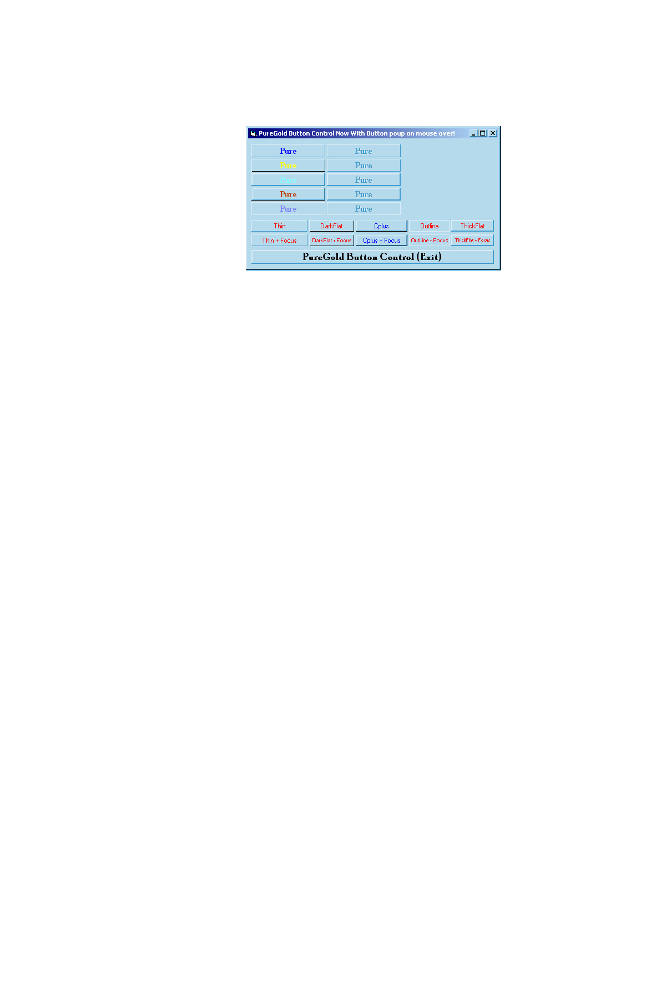

## PureGold Flat Push Button \(Updated\) 2

### Description

PureGold Button Control features a sleek thin 3D border insted of the ugly thick border on standerd windows. It also has four other styles of borders for you to try (yes even the classic thick border one), and now MOST inportant of all it has the mouse over feature meaning the button is flat untill the mouse is over it! <- This is optional see options for more info

Pictures in the control will come soon, as will tranlucentness and other skinable features.
 
### More Info
 

             |
---                |---
**Submitted On**   |2000-08-14 23:16:02
**By**             |[Jameson King](https://github.com/Planet-Source-Code/PSCIndex/blob/master/ByAuthor/jameson-king.md)
**Level**          |Advanced
**User Rating**    |4.0 (8 globes from 2 users)
**Compatibility**  |VB 6\.0
**Category**       |[Custom Controls/ Forms/  Menus](https://github.com/Planet-Source-Code/PSCIndex/blob/master/ByCategory/custom-controls-forms-menus__1-4.md)
**World**          |[Visual Basic](https://github.com/Planet-Source-Code/PSCIndex/blob/master/ByWorld/visual-basic.md)
**Archive File**   |[CODE\_UPLOAD89958162000\.zip](https://github.com/Planet-Source-Code/jameson-king-puregold-flat-push-button-updated-2__1-10716/archive/master.zip)

